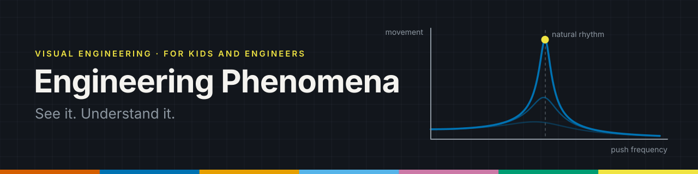

<p align="center">
  
</p>

# Engineering Phenomena

**Professional visual art that makes engineering phenomena easy to understand.**

Every piece in this collection tells the same story twice:

| Layer | Who it is for | What it gives |
|---|---|---|
| **See it** | Kids, curious people, anyone | An everyday hook, a picture that explains itself, one clear sentence |
| **Understand it** | Engineers and students | The governing equation, the assumptions, real numbers, real-world cases |

The rule that makes it professional: **beautiful, but never wrong.** Every animation must match the real physics. If something is exaggerated to make it visible, the image says so (for example "motion exaggerated x50").

---

## The collection

| # | Phenomenon | Field | Status |
|---|---|---|---|
| 01 | [Resonance](phenomena/01-resonance/) | Vibrations | Video v1 in production: script, physics, 3D scenes, graphics, sound and subtitles (EN / FR / AR) done; final renders running |

The full list of planned subjects is in the [backlog](docs/BACKLOG.md).

---

## How this repository is organised

```
engineering-phenomena/
├── phenomena/              one folder per phenomenon
│   ├── _template/          copy this to start a new one
│   └── 01-resonance/
│       ├── README.md       the explanation (kids layer + engineers layer + storyboard)
│       ├── blender/        .blend source files
│       ├── renders/        still images (PNG)
│       ├── video/          final videos (MP4)
│       ├── subtitles/      en.srt, fr.srt, ar.srt
│       ├── scripts/        the code that builds the piece (physics, Blender scenes, graphics, sound)
│       └── sources/        references, sketches, datasheets
├── assets/                 shared by every piece
│   ├── brand/              banner, logo
│   └── palette/            the house colours (Blender, Inkscape, GIMP, Krita)
├── tools/                  helper scripts: the Blender palette loader, and epmotion (the 2D motion graphics engine)
└── docs/
    ├── STYLE_GUIDE.md      colours, fonts, formats, accuracy rules
    ├── WORKFLOW.md         step by step: from idea to published piece
    └── BACKLOG.md          the list of phenomena to make next
```

## Start here

1. Read the [style guide](docs/STYLE_GUIDE.md) once. It is what makes every piece look like part of the same series.
2. Follow the [workflow](docs/WORKFLOW.md) to make a new piece.
3. Pick a subject from the [backlog](docs/BACKLOG.md).

## Languages

Explanations are written in English first. Subtitles are provided in **English, French and Arabic**.

## Rights

All artwork in this repository is original work by [@Mohamedalimabrouki](https://github.com/Mohamedalimabrouki). A licence will be chosen before the repository is made public.
